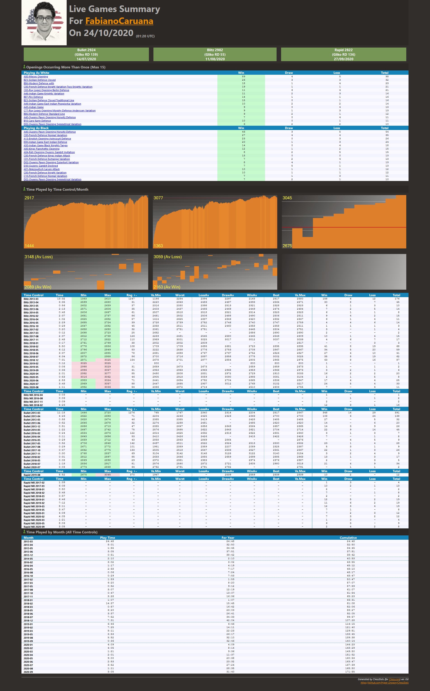

# ChessStats for [Chess.com](https://chess.com)

## About
ChessStats is a console app used to retrieve monthly play time, ratings and top openings for any chess.com user. Note that variant game types are not included in the stats (displayed as 'X' during game retrieval) and unrated game ('NR') information is time only. 

## Version History
__Version 0.7__ 
* CAPS scores, limited to the last 20 games, now included
* Changed background in stats pages
* Openings for last ??? games table added
* Fixed v0.6 missing assembly issue
* Migrated from Microsoft.CodeAnalysis.FxCopAnalyzers (depricated) to Microsoft.CodeAnalysis.NetAnalyzers

__Version 0.6__ 
* Graphs for ratings and monthly win/loss averages (included in Html Reports)
* Html index file generation _([location of executable]/ChessStatsResults/index.html)_
* Several minor fixes
* CAPS scores removed due to chess.com site changes
 
__Version 0.5__

* Output files written to a reporting directory _([location of executable]/ChessStatsResults/[Username]/)_ containing:
  * A full (self-contained) HTML Report
  * The original text report
  * Full PGN files (all games) for each time control
  * CAPs Data in TSV format for easy spreadsheet import
* A refresh data option (for each user in the reporting directory)
* Caching for previously retrieved game and CAPs data at _([location of executable]/ChessStatsCache/CacheV1/[Username])_
* Error handling improvements
* Several minor display fixes

__version 0.4__ 
* CAPS averages broken down by time control.  
    * These are available for games that have been analysed on the chess.com website (games with no analysis are marked with '-' on ingest). 

## Installation
Download the latest version from the [Releases](https://github.com/Hyper-Dragon/ChessStats/releases) page, extract _ChessStats.exe_ and put it where you want it to go.  Note that the cache and reporting directories are created relative to the executable's location. 

## Saying Thank You
If you find this useful and want to say thanks just send me a fun trophy or two or three over on chess.com :smiley:

## Usage
```
chessstats [chessdotcom username]
```
or 
```
chessstats -refresh
```
or 
just double click the _exe_ and you will be prompted for a chess.com username.

## Example Output (HTML)


## Example Output Fragments (Text)

```
> chessstats fabianocaruana
```

<pre>
=================== Live Chess Report for FabianoCaruana : 24/10/2020@01:33 UTC ====================

======== Openings Occurring More Than Once (Max 15) ========

Playing As White                                                        | Tot.
------------------------------------------------------------------------+------
A00-Mieses Opening                                                      |   98
B23-Sicilian Defense Closed                                             |   32
B06-Modern Defense with                                                 |   23
C00-French Defense Knight Variation Two Knights Variation               |   21
C65-Ruy Lopez Opening Berlin Defense                                    |   21
A46-Indian Game Knights Variation                                       |   16
B07-Pirc Defense                                                        |   16
B23-Sicilian Defense Closed Traditional Line                            |   16
A49-Indian Game East Indian Przepiorka Variation                        |   14
A45-Indian Game                                                         |   13
C77-Ruy Lopez Opening Morphy Defense Anderssen Variation                |   13
B06-Modern Defense Standard Line                                        |   12
A40-Queens Pawn Opening Horwitz Defense                                 |   11
B10-Caro Kann Defense                                                   |   11
D02-Queens Pawn Opening Symmetrical Variation                           |   10

Playing As Black                                                        | Tot.
------------------------------------------------------------------------+------
A40-Queens Pawn Opening Horwitz Defense                                 |   54
C00-French Defense Normal Variation                                     |   35
A13-English Opening Agincourt Defense                                   |   26
E00-Indian Game East Indian Defense                                     |   24
A50-Indian Game Black Knights Tango                                     |   18
A00-Kings Fianchetto Opening                                            |   15
A04-Reti Opening Queens Gambit Invitation                               |   15
C00-French Defense Kings Indian Attack                                  |   13
C01-French Defense Exchange Variation                                   |   13
D02-Queens Pawn Opening Zukertort Variation                             |   13
D30-Queens Gambit Declined                                              |   13
A01-Nimzowitsch Larsen Attack                                           |   12
C00-French Defense Knight Variation                                     |   12
C10-French Defense Normal Variation                                     |   11
D02-Queens Pawn Opening Symmetrical Variation                           |   10

======== Time Played/Ratings by Time Control/Month =========

Time Control/Month| Play Time | Rating Min/Max/+-  | Vs Min/BestWin/Max | Win  | Draw | Loss | Tot.
------------------+-----------+--------------------+--------------------+------+------+------+------
Blitz     2013-03 |  13:32:52 | 1363 | 2610 | 1247 | 1186 | 2517 | 2580 |  158 |    6 |   12 |  176
Blitz     2013-04 |   3:35:46 | 2599 | 2630 |   31 | 2220 | 2564 | 2571 |   30 |    8 |    7 |   45
Blitz     2013-05 |   0:56:56 | 2602 | 2639 |   37 | 2316 | 2328 | 2523 |    6 |    1 |    3 |   10
Blitz     2013-06 |   2:13:00 | 2571 | 2606 |   35 | 2403 | 2474 | 2484 |    7 |    2 |    5 |   14
Blitz     2014-05 |   0:48:46 | 2606 | 2667 |   61 | 2507 | 2523 | 2523 |    6 |    1 |    1 |    8
Blitz     2016-02 |   2:37:17 | 2651 | 2737 |   86 | 2481 | 2506 | 2511 |    9 |    4 |    2 |   15
Blitz     2016-04 |   1:02:15 | 2625 | 2682 |   57 | 1414 | 2632 | 2647 |    6 |    1 |    4 |   11
Blitz     2016-05 |   2:29:13 | 2685 | 2724 |   39 | 2728 | 2747 | 2759 |    4 |    4 |    6 |   14
Blitz     2016-10 |   0:29:32 | 2647 | 2692 |   45 | 2358 | 2358 | 2511 |    1 |    1 |    1 |    3
Blitz     2017-02 |   0:20:30 | 2658 | 2690 |   32 | 2361 | 2504 | 2751 |    3 |    - |    1 |    4
Blitz     2017-03 |   0:12:15 | 2698 | 2723 |   25 | 2682 | 2690 | 2690 |    2 |    - |    - |    2
Blitz     2017-08 |   2:37:42 | 2612 | 2738 |  126 | 2259 | 2549 | 2609 |   10 |    1 |    4 |   15
Blitz     2017-11 |   2:48:31 | 2712 | 2822 |  110 | 2989 | 3037 | 3039 |    4 |    6 |    7 |   17
Blitz     2018-01 |   0:17:49 | 2761 | 2799 |   38 | 2802 |    - | 2817 |    - |    - |    3 |    3
Blitz     2018-02 |   5:50:00 | 2778 | 2886 |  108 | 1709 | 2895 | 2895 |   41 |    8 |   19 |   68
Blitz     2018-05 |   6:12:02 | 2796 | 2849 |   53 | 2222 | 2867 | 2867 |   34 |    5 |   20 |   59
Blitz     2018-06 |   3:37:47 | 2807 | 2885 |   78 | 2681 | 2826 | 2827 |   27 |    4 |   10 |   41
Blitz     2018-07 |   6:34:07 | 2872 | 2958 |   86 | 2700 | 3002 | 3025 |   35 |    8 |   19 |   62
Blitz     2018-12 |   7:31:09 | 2871 | 3025 |  154 | 2678 | 2965 | 2975 |   63 |    8 |   16 |   87
Blitz     2019-02 |   0:12:10 | 3025 | 3025 |    - |  800 |  800 |  800 |    1 |    - |    - |    1
Blitz     2019-05 |   0:06:26 | 2998 | 3029 |   31 | 2659 | 2659 | 2673 |    1 |    - |    1 |    2
Blitz     2019-09 |   0:36:12 | 2996 | 3057 |   61 | 2953 | 2966 | 2973 |    3 |    2 |    1 |    6
Blitz     2020-04 |   2:01:53 | 2992 | 3077 |   85 | 2490 | 2910 | 3033 |   16 |    2 |    2 |   20
Blitz     2020-05 |   0:53:52 | 3016 | 3062 |   46 | 2905 | 3081 | 3104 |    2 |    1 |    5 |    8
Blitz     2020-06 |   2:53:49 | 2953 | 3024 |   71 | 2441 | 2836 | 2847 |   17 |    4 |    4 |   25
Blitz     2020-07 |   3:48:13 | 2969 | 3057 |   88 | 2447 | 3102 | 3217 |   24 |    5 |    4 |   33
Blitz     2020-08 |   1:11:04 | 2982 | 3036 |   54 | 2366 | 2603 | 2755 |    7 |    - |    4 |   11
------------------+-----------+--------------------+--------------------+------+------+------+------
Blitz  NR 2016-04 |   0:03:50 |    - |    - |    - |    - |    - |    - |    1 |    - |    - |    1
Blitz  NR 2016-08 |   0:06:57 |    - |    - |    - |    - |    - |    - |    - |    1 |    1 |    2
Blitz  NR 2017-11 |   0:09:23 |    - |    - |    - |    - |    - |    - |    2 |    - |    - |    2
Blitz  NR 2018-02 |   4:26:17 |    - |    - |    - |    - |    - |    - |   12 |    3 |    1 |   16
------------------+-----------+--------------------+--------------------+------+------+------+------
Bullet    2013-03 |  11:15:27 | 1444 | 2720 | 1276 |  765 | 2517 | 2567 |  348 |   14 |   29 |  391
Bullet    2013-04 |   4:26:03 | 2622 | 2693 |   71 | 2204 | 2700 | 2700 |  108 |    6 |   24 |  138
Bullet    2013-05 |   0:58:55 | 2628 | 2674 |   46 | 2385 | 2485 | 2485 |   27 |    - |    5 |   32
Bullet    2013-06 |   0:52:15 | 2646 | 2678 |   32 | 2274 | 2620 | 2620 |   14 |    - |    6 |   20
Bullet    2013-12 |   0:51:21 | 2666 | 2713 |   47 | 2355 | 2657 | 2665 |   14 |    3 |    9 |   26
Bullet    2014-05 |   1:22:06 | 2667 | 2742 |   75 | 2576 | 2704 | 2714 |   22 |    9 |   14 |   45
Bullet    2016-02 |   0:24:44 | 2554 | 2676 |  122 | 2614 | 2631 | 2640 |    3 |    1 |    3 |    7
Bullet    2016-04 |   0:11:02 | 2643 | 2696 |   53 | 2410 | 2422 | 2426 |    7 |    - |    1 |    8
Bullet    2016-05 |   0:29:09 | 2669 | 2712 |   43 | 2858 |    - | 2876 |    - |    4 |    5 |    9
Bullet    2017-05 |   0:52:02 | 2706 | 2848 |  142 | 2497 | 2530 | 2532 |   23 |    1 |    4 |   28
Bullet    2017-08 |   0:29:41 | 2671 | 2772 |  101 | 1951 | 2325 | 2387 |    5 |    3 |    1 |    9
Bullet    2017-10 |   0:47:33 | 2642 | 2775 |  133 | 2505 | 2561 | 2567 |   22 |    1 |    3 |   26
Bullet    2017-11 |   0:30:56 | 2768 | 2837 |   69 | 3104 | 3140 | 3154 |    3 |    2 |    4 |    9
Bullet    2018-02 |   0:31:59 | 2812 | 2897 |   85 | 2633 | 2885 | 2963 |   13 |    1 |    3 |   17
Bullet    2018-05 |   0:08:54 | 2869 | 2898 |   29 | 2972 | 2976 | 2987 |    2 |    - |    3 |    5
Bullet    2018-07 |   1:18:11 | 2836 | 2917 |   81 | 2576 | 2980 | 3018 |   21 |    4 |    9 |   34
Bullet    2020-07 |   0:03:50 | 2774 | 2838 |   64 | 2782 |    - | 2791 |    - |    1 |    1 |    2
------------------+-----------+--------------------+--------------------+------+------+------+------
Rapid     2019-08 |   5:52:58 | 2675 | 3045 |  370 | 1947 | 2839 | 2839 |   10 |    2 |    - |   12
------------------+-----------+--------------------+--------------------+------+------+------+------
Rapid  NR 2017-02 |   1:39:20 |    - |    - |    - |    - |    - |    - |    1 |    3 |    - |    4
Rapid  NR 2017-03 |   6:08:15 |    - |    - |    - |    - |    - |    - |   10 |    2 |    1 |   13
Rapid  NR 2018-01 |   0:50:06 |    - |    - |    - |    - |    - |    - |    2 |    - |    - |    2
Rapid  NR 2018-02 |   3:48:56 |    - |    - |    - |    - |    - |    - |    7 |    - |    1 |    8
Rapid  NR 2018-03 |   0:57:37 |    - |    - |    - |    - |    - |    - |    2 |    - |    - |    2
Rapid  NR 2019-01 |   6:46:40 |    - |    - |    - |    - |    - |    - |   12 |    5 |    2 |   19
Rapid  NR 2019-02 |   7:12:58 |    - |    - |    - |    - |    - |    - |   11 |    6 |    2 |   19
Rapid  NR 2019-03 |   8:11:37 |    - |    - |    - |    - |    - |    - |   12 |    3 |    4 |   19
Rapid  NR 2019-05 |   3:47:18 |    - |    - |    - |    - |    - |    - |    7 |    1 |    - |    8
Rapid  NR 2020-01 |   4:09:02 |    - |    - |    - |    - |    - |    - |    7 |    2 |    3 |   12
Rapid  NR 2020-02 |   4:05:33 |    - |    - |    - |    - |    - |    - |    7 |    3 |    2 |   12
Rapid  NR 2020-03 |   1:21:30 |    - |    - |    - |    - |    - |    - |    1 |    3 |    - |    4
Rapid  NR 2020-05 |   8:06:53 |    - |    - |    - |    - |    - |    - |    6 |    3 |    - |    9
Rapid  NR 2020-09 |   3:05:13 |    - |    - |    - |    - |    - |    - |    2 |    4 |    2 |    8

========= Time Played by Month (All Time Controls) =========

Month             |  Play Time  |   For Year  |  Cumulative
------------------+-------------+-------------+-------------
2013-03           |    24:48:19 |    24:48:19 |    24:48:19
2013-04           |     8:01:49 |    32:50:08 |    32:50:08
2013-05           |     1:55:51 |    34:45:59 |    34:45:59
2013-06           |     3:05:15 |    37:51:14 |    37:51:14
2013-12           |     0:51:21 |    38:42:35 |    38:42:35
------------------+-------------+-------------+-------------
2014-05           |     2:10:52 |     2:10:52 |    40:53:27
------------------+-------------+-------------+-------------
2016-02           |     3:02:01 |     3:02:01 |    43:55:28
2016-04           |     1:17:07 |     4:19:08 |    45:12:35
2016-05           |     2:58:22 |     7:17:30 |    48:10:57
2016-08           |     0:06:57 |     7:24:27 |    48:17:54
2016-10           |     0:29:32 |     7:53:59 |    48:47:26
------------------+-------------+-------------+-------------
2017-02           |     1:59:50 |     1:59:50 |    50:47:16
2017-03           |     6:20:30 |     8:20:20 |    57:07:46
2017-05           |     0:52:02 |     9:12:22 |    57:59:48
2017-08           |     3:07:23 |    12:19:45 |    61:07:11
2017-10           |     0:47:33 |    13:07:18 |    61:54:44
2017-11           |     3:28:50 |    16:36:08 |    65:23:34
------------------+-------------+-------------+-------------
2018-01           |     1:07:55 |     1:07:55 |    66:31:29
2018-02           |    14:37:12 |    15:45:07 |    81:08:41
2018-03           |     0:57:37 |    16:42:44 |    82:06:18
2018-05           |     6:20:56 |    23:03:40 |    88:27:14
2018-06           |     3:37:47 |    26:41:27 |    92:05:01
2018-07           |     7:52:18 |    34:33:45 |    99:57:19
2018-12           |     7:31:09 |    42:04:54 |   107:28:28
------------------+-------------+-------------+-------------
2019-01           |     6:46:40 |     6:46:40 |   114:15:08
2019-02           |     7:25:08 |    14:11:48 |   121:40:16
2019-03           |     8:11:37 |    22:23:25 |   129:51:53
2019-05           |     3:53:44 |    26:17:09 |   133:45:37
2019-08           |     5:52:58 |    32:10:07 |   139:38:35
2019-09           |     0:36:12 |    32:46:19 |   140:14:47
------------------+-------------+-------------+-------------
2020-01           |     4:09:02 |     4:09:02 |   144:23:49
2020-02           |     4:05:33 |     8:14:35 |   148:29:22
2020-03           |     1:21:30 |     9:36:05 |   149:50:52
2020-04           |     2:01:53 |    11:37:58 |   151:52:45
2020-05           |     9:00:45 |    20:38:43 |   160:53:30
2020-06           |     2:53:49 |    23:32:32 |   163:47:19
2020-07           |     3:52:03 |    27:24:35 |   167:39:22
2020-08           |     1:11:04 |    28:35:39 |   168:50:26
2020-09           |     3:05:13 |    31:40:52 |   171:55:39

=============== Total Play Time (Live Chess) ===============

Time Played (hh:mm:ss):    171:55:39
</pre>

## Known Issues
* Version 0.7
    * None (yet)
* Version 0.6
    * CAPS scores are not available due to Chess.com site changes
    * Error: An assembly specified in the application dependencies manifest (ChessStats.deps.json) was not found 
        * Delete the folder C:\Users\<username>\AppData\Local\Temp\ .net\ and rerun

## Dependencies

* [ChessDotComSharp](https://github.com/nullablebool/ChessDotComSharp) @nullablebool
* Chess.com Api
* ~~Chess.com website HTML for CAPs extraction (broken)~~
* Chess.com undocumented endpoint for CAPs extraction (last 20 games only)

## Acknowledgements

* [Chess.Com](https://github.com/ChessCom) @ChessCom
* Covid-19 & Social Isolation
* Thanks to chess.com users _BaronVonChickenpants_ and _maxmlynek2_ for bug spotting
* Thanks to chess.com user _NefariousNebula_ for highlighting the (undocumented) CAPS endpoint
