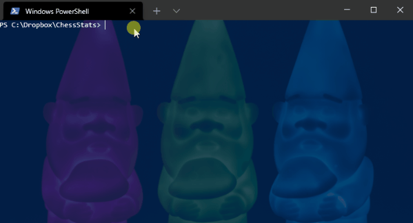

# ChessStats for chess.com

## About

ChessStats is a console app used to retrieve monthly play time, ratings and top openings for any Chess.com user. Note that variant game types are not included in the stats (displayed as 'X' during game retrieval) and unrated game ('NR') information is time only.

The HTML reports generated are standalone with all assets (images/fonts) embedded in the page.  This means they can be sent to others, or indeed just opened as a document.  

Personally, I sync my ChessStats folder with dropbox so I can read the reports directly on my tablet from the Dropbox app.

## Installation

Download the latest version from the [Releases](https://github.com/Hyper-Dragon/ChessStats/releases) page, extract _ChessStats.exe_ and put it where you want it to go.  **Note that the cache and reporting directories are created relative to the executable's location**.

## Usage

``` Powershell
chessstats [chessdotcom username]
```

or

``` Powershell
chessstats -refresh
```

or just double click the _exe_ and you will be prompted for a Chess.com username.



## Version History

### Version 0.8 
* Full CAPS Scores for all games analysed on Chess.com
  * All games graph
  * 3 Game Rolling Average
  * 10 Game Rolling Average
* Improved Graph Rendering (.svg)
* Removed the dependency on libgdiplus (linux only)
* Changed the report section ordering
* Added a linux arm build
 
### Version 0.7

* CAPS scores, limited to the last 20 games, now included
* Openings for the last 40 games table added
* Various Html improvements including:
  * Favicon added to pages
  * Image used for the background
  * Embedded fonts
  * Dark tables
* The index file is only generated once per run
* Fixed v0.6 missing assembly issue
* Removed Microsoft.CodeAnalysis.FxCopAnalyzers (deprecated)
* Switched to .Net 6.0

### Version 0.6

* Graphs for ratings and monthly win/loss averages (included in Html Reports)
* Html index file generation _([location of executable]/ChessStatsResults/index.html)_
* Several minor fixes
* CAPS scores removed due to Chess.com site changes

### Version 0.5

* Output files written to a reporting directory _([location of executable]/ChessStatsResults/[Username]/)_ containing:
  * A full (self-contained) HTML Report
  * The original text report
  * Full PGN files (all games) for each time control
  * CAPs Data in TSV format for easy spreadsheet import
* A refresh data option (for each user in the reporting directory)
* Caching for previously retrieved game and CAPs data at _([location of executable]/ChessStatsCache/CacheV1/[Username])_
* Error handling improvements
* Several minor display fixes

### Version 0.4

* CAPS averages are broken down by time control.  
  * These are available for games that have been analysed on the Chess.com website (games with no analysis are marked with '-' on ingest).

## Known Issues

* Version 0.8
  * None (yet)
* Version 0.7
  * None
* Version 0.6
  * CAPS scores are not available due to Chess.com site changes
  * Error: An assembly specified in the application dependencies manifest (ChessStats.deps.json) was not found 
    * Delete the folder C:\Users\<username>\AppData\Local\Temp\ .net\ and rerun
  * Error: Unable to write index.html 
    * Make sure that index.html is not in use and rerun

## License

This is free and unencumbered software released into the public domain.

Anyone is free to copy, modify, publish, use, compile, sell, or distribute this software, either in source code form or as a compiled binary, for any purpose, commercial or non-commercial, and by any means.

THE SOFTWARE IS PROVIDED "AS IS", WITHOUT WARRANTY OF ANY KIND, EXPRESS OR IMPLIED, INCLUDING BUT NOT LIMITED TO THE WARRANTIES OF MERCHANTABILITY, FITNESS FOR A PARTICULAR PURPOSE AND NONINFRINGEMENT. IN NO EVENT SHALL THE AUTHORS BE LIABLE FOR ANY CLAIM, DAMAGES OR OTHER LIABILITY, WHETHER IN AN ACTION OF CONTRACT, TORT OR OTHERWISE, ARISING FROM, OUT OF OR IN CONNECTION WITH THE SOFTWARE OR THE USE OR OTHER DEALINGS IN THE SOFTWARE.

For more information, please refer to [unlicense.org](https://unlicense.org).

## Saying Thank You

If you find this useful and want to say thanks [just send me a fun trophy or two or three](https://www.chess.com/member/hyper-dragon) over on chess.com.  If you find it really useful then consider hitting the donate button at the top of the page.

## Example Output (HTML)


